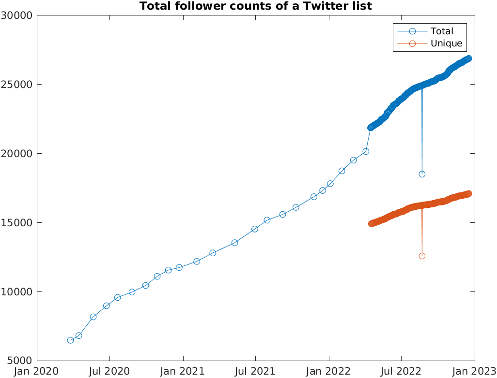

# Follower 数推移の自動記録
Copyright (c) 2022 Michio Inoue.

日本語でつぶやく MATLAB/Simulink の中の人達（MATLAB Student Ambassador 含む）をまとめた
 [List](https://twitter.com/i/lists/1483201415342596096) を作っています。
こちらの member の Follower 数の合計をトラックしてみたいと思います。

GitHub Actions の練習課題として作りました。

## 環境

 - MATLAB R2022a
 - Datafeed Toolbox (for Twitter API) 

## 結果

 